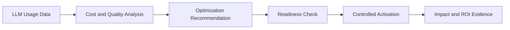
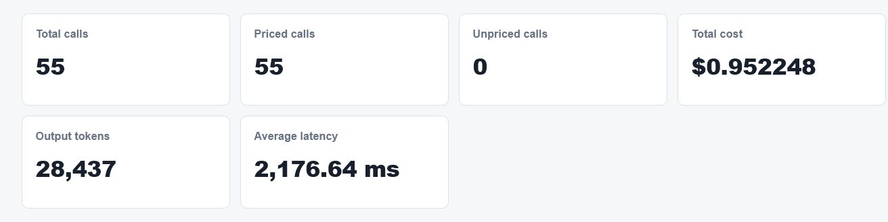
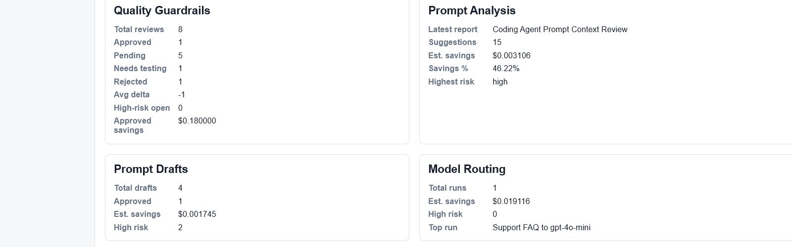
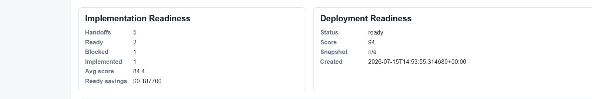
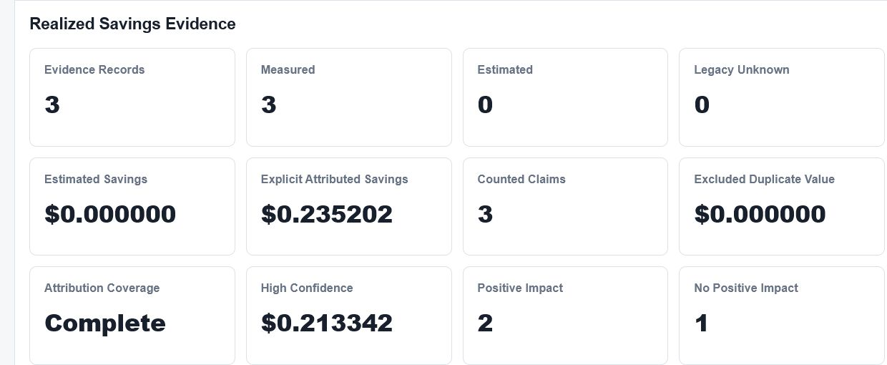

# LLM Cost and ROI Optimization Platform

A local MVP for analyzing LLM usage cost, optimization opportunities, quality risk, and ROI evidence. This repository is a deliberately limited portfolio case study: it shows verified product outcomes while the complete source code and internal implementation remain private.

All screenshots and sample values in this repository use synthetic demo data.

## The Problem

Many teams can see a total model bill but cannot clearly determine:

- where the cost comes from;
- which optimization opportunities are worth acting on;
- whether claimed savings are credible;
- whether an optimization may reduce output quality; or
- whether a problematic change can be reversed safely.

## Core Capabilities

- **LLM usage and cost analysis** - summarizes usage, token volume, latency, and cost outcomes.
- **Optimization opportunity detection** - surfaces areas that may deserve review and action.
- **Quality guardrails** - keeps quality risk visible alongside savings opportunities.
- **Measured and estimated impact attribution** - distinguishes observed evidence from estimates.
- **Readiness checks before activation** - makes unresolved risks visible before a change is enabled.
- **Reversible activation, rollback and evidence reporting** - supports controlled change management and reviewable outcomes.

## High-Level Workflow

## Product Evidence

### Usage and Cost Overview

### Optimization and Quality Analysis

### Readiness Check

### ROI Evidence

An intentionally limited [synthetic result sample](samples/synthetic-optimization-result.json) and an aggregated [evaluation summary](docs/evaluation-summary.md) are included for review.

## Validation Summary

Latest local validation on **July 15, 2026**:

| Area | Result |
| --- | --- |
| Backend | 383 tests passed |
| Frontend reliability | 25/25 passed |
| Frontend TypeScript check | Passed |
| Next.js production build | Passed |
| SDK tests and build | Passed |

No live provider, billing account, production database, or production user data was used during this validation.

## My Role

My contribution included:

- translating the product idea into phased requirements and development tasks;
- defining cost, quality, attribution, and acceptance boundaries;
- designing readiness, activation, and rollback workflows;
- using Codex to drive implementation;
- reviewing Git changes and test outcomes;
- diagnosing failures and iterating on the product;
- defining data-safety, rollback, and audit requirements; and
- completing final functional acceptance.

This case study does not claim that I independently hand-wrote every line of the private implementation.

## Current Status

- Local MVP; not deployed.
- No production users.
- No provider billing-level reconciliation completed.
- No production-grade multi-tenancy, authentication, or billing operation.
- Complete source code and internal implementation remain private.

This repository is evidence of a working, locally validated product prototype, not a production-service claim.
